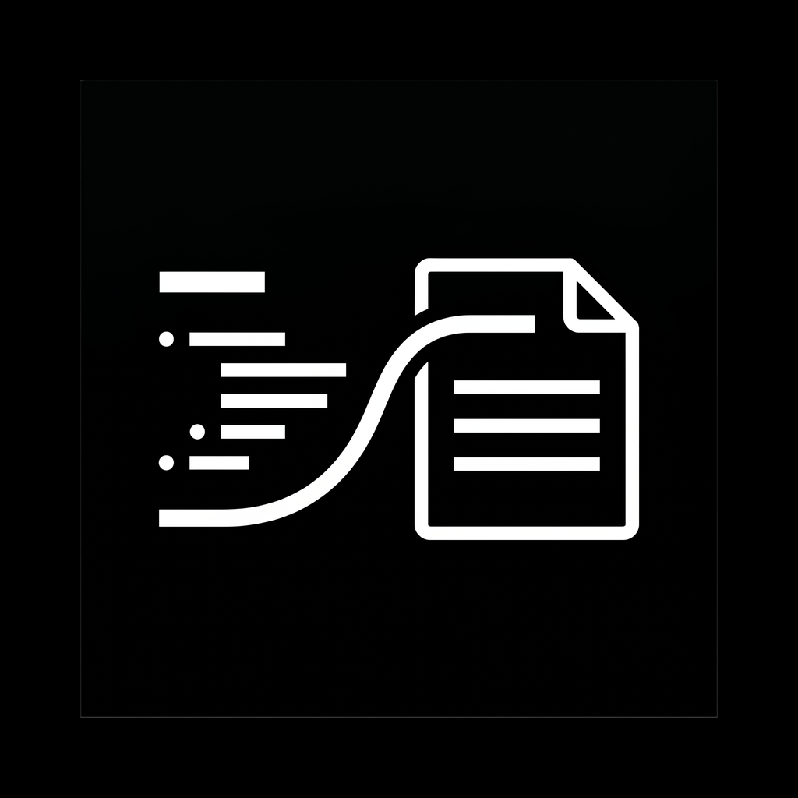
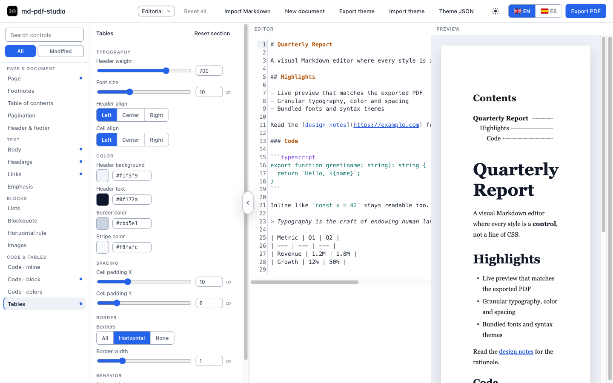
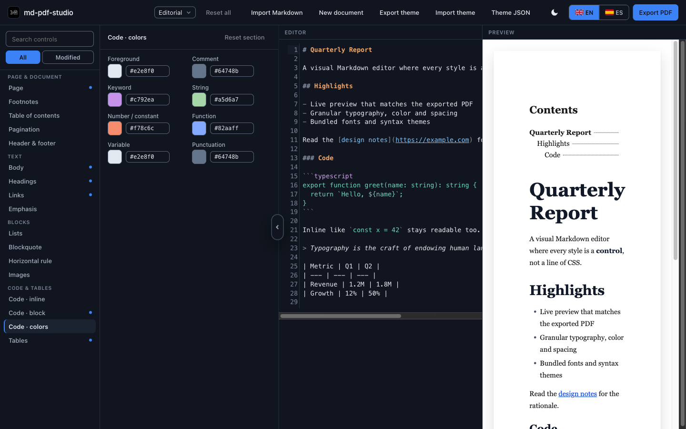

<div align="center">



# md-pdf-studio

**A visual Markdown → PDF editor — design the document, never touch the CSS.**




<em>Adjust granular per-element style controls on the left; edit Markdown in the middle; see the exact PDF on the right.</em>

</div>

Write Markdown, then style the resulting PDF with **~155 granular controls** — per-element typography, color, spacing, tables, code, syntax token colors, page setup, headers/footers — all through a live **WYSIWYG** preview. No CSS, no templating language: you adjust bounded controls and watch the page update. It ships as both a **web** app and a **desktop** app over one shared core.

<div align="center">

<br/>
<em>Dark mode, editing syntax-highlight colors as a swatch grid.</em>
</div>

## Features

- **~155 schema-driven controls** — every control is a bounded slider, color, toggle, or enum; there is no path from your input to arbitrary CSS.
- **True WYSIWYG** — the live preview and the exported PDF are produced by the *same* CSS generator and the *same* syntax highlighter, so what you see is what prints.
- **One core, two shells** — a Next.js web app (Puppeteer) and an Electron desktop app share all the rendering logic behind a single `RenderPort`.
- **Real print features** — multi-page table of contents with page numbers, configurable headers/footers, page size & margins, widows/orphans control.
- **Bundled fonts & themes** — Inter + JetBrains Mono ship with the app; versioned theme presets; import/export a theme as JSON.
- **Bilingual UI** — English / Spanish.

## Requirements

- **Node.js ≥ 20**
- **pnpm 9** (`corepack enable` will provide it)
- A Chromium build for PDF export on the web app — installed for you by `make setup`.

## Setup

```bash
git clone https://github.com/RayverAimar/md-pdf-studio.git
cd md-pdf-studio
make setup        # install dependencies + the Chromium used for PDF export
```

## Running

```bash
make dev          # web app  → http://localhost:3000
make dev-desktop  # desktop app (Electron)
make dev-app      # both at once
```

Open the web app, edit the Markdown, tweak the controls on the left, and hit **Export PDF**.

## How it works

The whole product rests on one idea: **the schema is the single source of truth.** `packages/core/schema.ts`
declares every control — its type, bounds, and the CSS it emits. Both the controls UI and the stylesheet
generator are *derived* from that schema, so adding a control is one entry, never hand-wired in two places.

Because the live preview and the PDF both run the same `generateCss` output and the same
[Shiki](https://shiki.style/) highlighter, the preview can't drift from the print. The two shells differ only
in *how* they drive Chromium — the web app via Puppeteer's `page.pdf()`, the desktop app via Electron's
`webContents.printToPDF()` — hidden behind a shared `RenderPort`. The table of contents is resolved in two
passes (Chromium has no `target-counter`): the document is printed once to map each heading to its page via
pdf.js, then re-printed with the page numbers filled in.

## Project structure

```
packages/
  core/      framework-agnostic TS — schema (the control definitions),
             CSS generator, markdown (markdown-it), highlight (Shiki), sanitize
  render/    RenderPort interface + the shared 2-pass table-of-contents
  ui/        React components, Zustand store, web-worker render pipeline
apps/
  web/       Next.js — PuppeteerRenderPort
  desktop/   Electron — ElectronRenderPort via webContents.printToPDF()
presets/     versioned theme JSONs
fonts/       bundled Inter + JetBrains Mono (SIL OFL)
```

## Stack

| Layer | Tool |
|---|---|
| Language | TypeScript (strictest config) |
| Monorepo | pnpm workspaces + Turborepo |
| Web | Next.js 16 + Puppeteer |
| Desktop | Electron 42 (ESM main) |
| UI | React 19, Zustand, CodeMirror 6 |
| Markdown | markdown-it |
| Syntax highlighting | Shiki |
| TOC page mapping | pdf.js |
| Tooling | Biome 2 (lint + format + imports), Vitest |

## Commands

Run `make help` to list everything. The most-used targets:

| Command | What it does |
|---|---|
| `make setup` | Install dependencies + the export Chromium |
| `make dev` | Run the web app (`localhost:3000`) |
| `make dev-desktop` | Run the desktop app |
| `make build` | Build every package and app |
| `make check` | Lint + typecheck + tests (the pre-commit gate) |
| `make format` | Auto-format and apply safe fixes |
